📱 Lavescape - Experience Booking App
A Flutter mobile application for discovering and booking authentic local experiences.

🎯 About
This is a UI implementation project showcasing a complete mobile app design with authentication, search, and booking features. Built with Flutter following modern design patterns.

✨ Features

🔐 Authentication (Phone/Email signup, OTP verification, Login)
🔍 Advanced search with filters (Location, Date, Guests)
📅 Interactive date range picker
👥 Guest selection (Adults/Children)
🗺️ Map and List view toggle
🎨 Responsive design for all screen sizes
⚡ Smooth animations and transitions


🛠️ Tech Stack

Flutter 3.0+
Dart 3.0+
flutter_screenutil - Responsive design
table_calendar - Date picker
intl_phone_field - Phone input
flutter_svg - Icons


## 📱 App Flow
```
Authentication → Explore → Search → Results → Map View
```

### Screens Implemented:
- Welcome & Login
- Sign Up (Phone/Email)
- OTP Verification
- Profile Completion
- Explore (Home)
- Search with Filters
- Search Results
- Map View

---

## 🎨 Design

**Color Scheme:**
- Primary: `#9333EA` (Purple)
- Secondary: `#6B7280` (Grey)
- Background: `#FAFAFA`

**UI Features:**
- Clean, modern interface
- Consistent spacing and typography
- Smooth animations
- Intuitive navigation

---

## 📂 Project Structure
```
lib/
├── core/
│   ├── helpers/       # Utils & extensions
│   ├── routing/       # Navigation
│   ├── theme/         # Colors & styles
│   └── widgets/       # Reusable widgets
│
├── feature/
│   ├── auth/          # Authentication
│   ├── explore/       # Main features
│   └── navigation/    # Bottom nav
│
└── main.dart


---

## 🖼️ Screenshots

| Login | OTP | Explore | Search | Map | Profile |
|-------|-----|---------|--------|-----|---------|
| 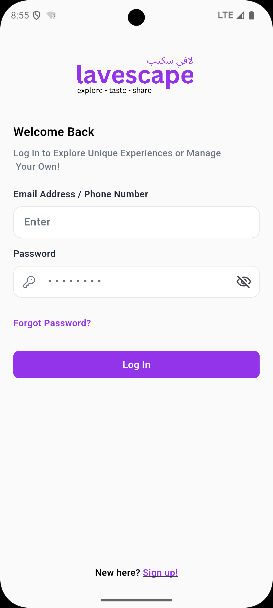 | 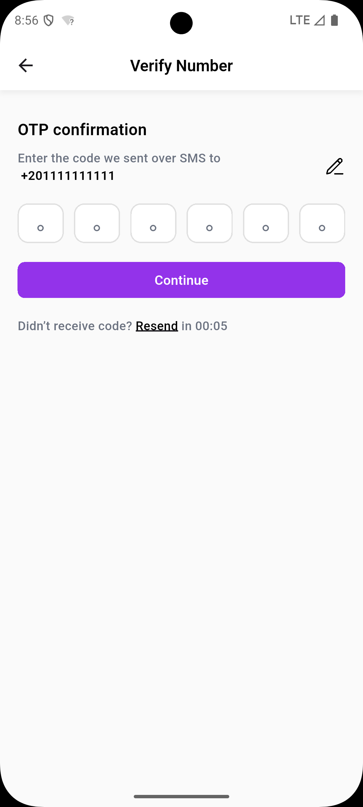 | 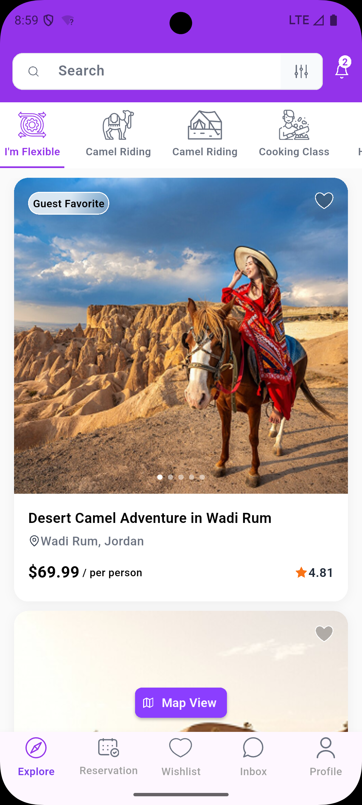 | 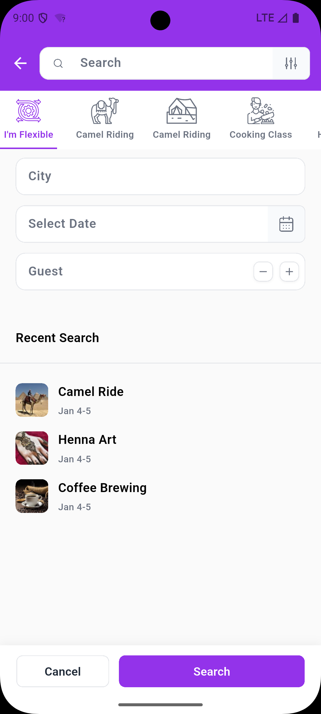 | 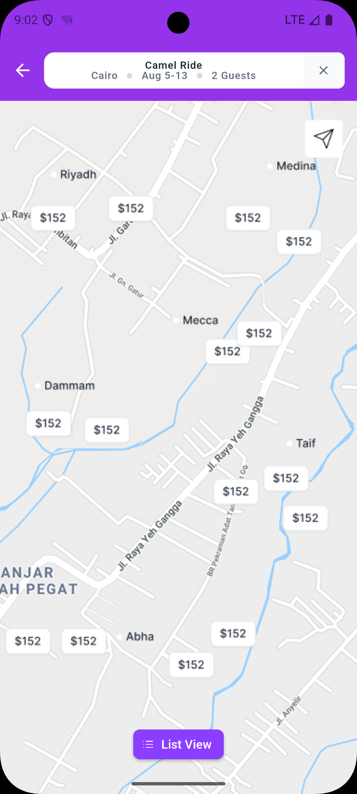 | 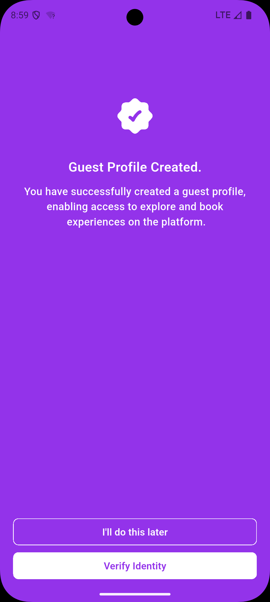 |

More screens:
- 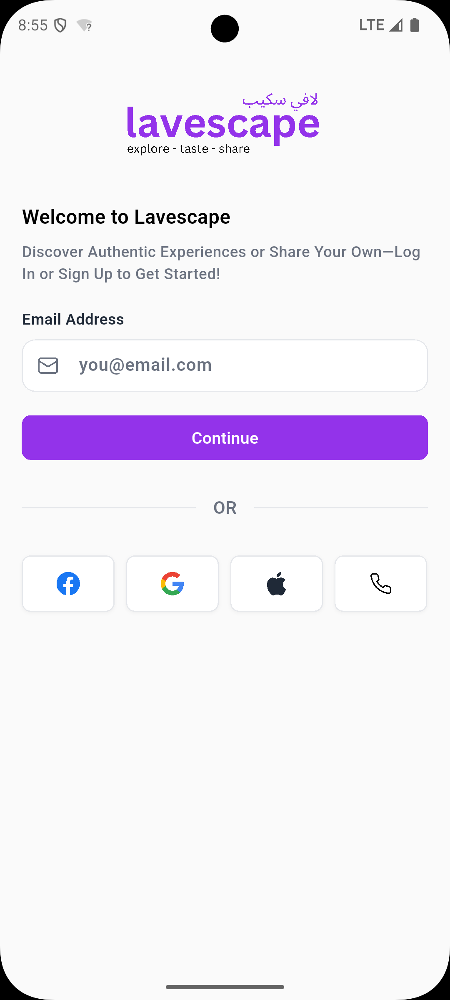
- 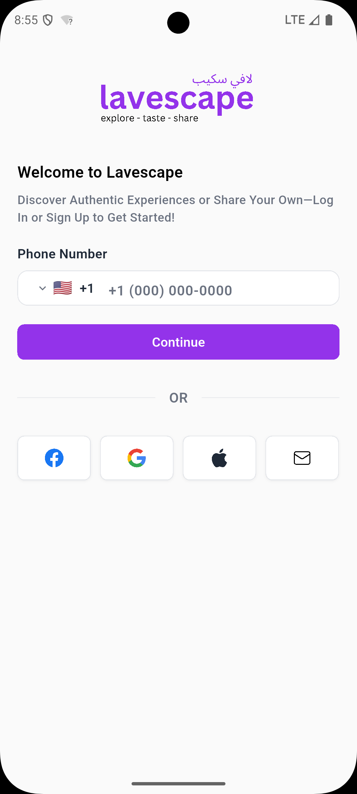
- 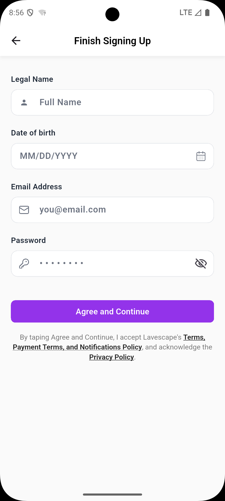
- 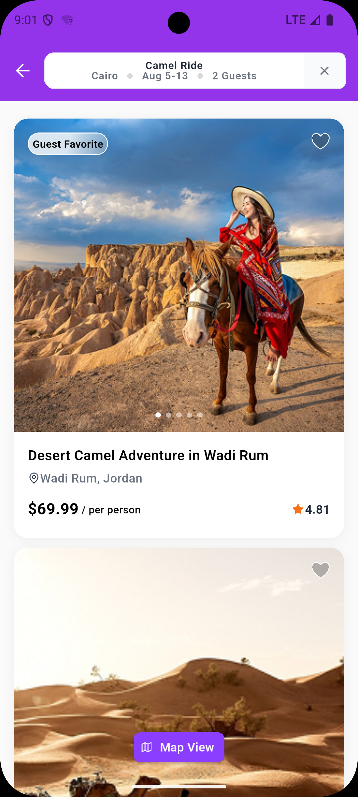
- 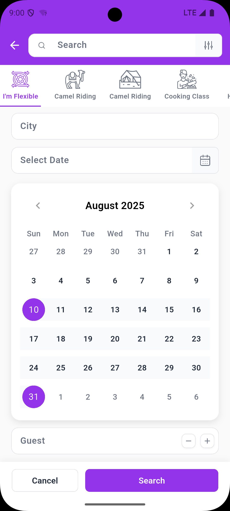
- 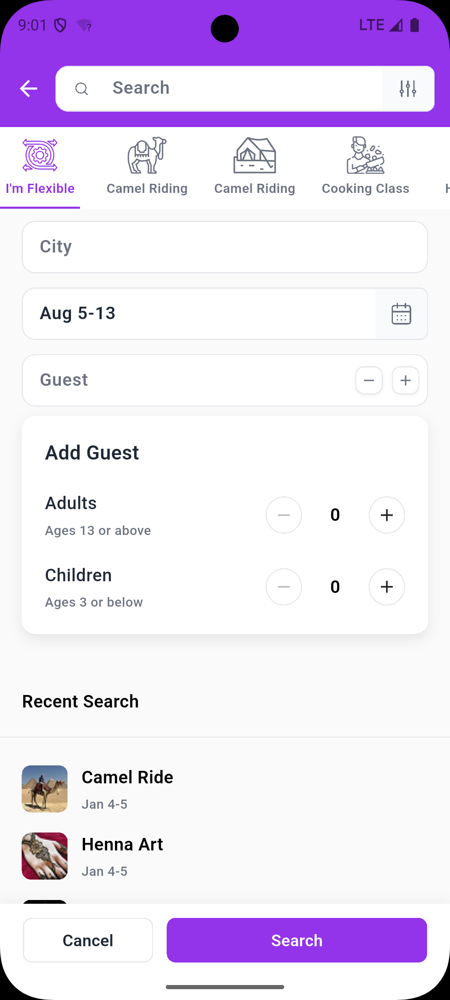
- 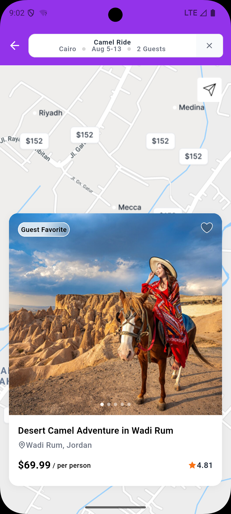

<div align ="center">
Made with Flutter 💙
⭐ Star this repo if you found it helpful!
</div>